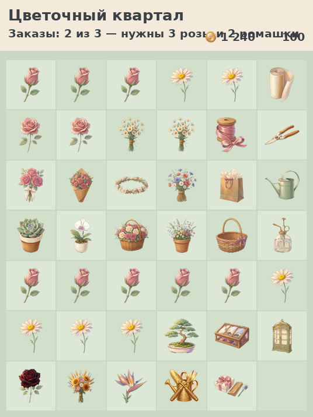

# Цветочный квартал — Flower Quarter

Браузерная игра: мердж цветов кормит тайкун цветочного магазина, который вырастает в квартал. Сессия 9-11 минут, вес 3.9MB, 63 теста зелёных.

**Платформа:** Yandex Games (HTML5) — сейчас играбельный билд без SDK (SDK отложен в крайнюю очередь)  
**Жанр:** merge + idle/tycoon  
**Стек:** TypeScript + Vite, рендер DOM + CSS спрайты, WebAudio синтез  
**Статус:** ветка `arena/01a103b7-mergegame` от `main` d35860e, 76 спрайтов +2 фона =78 картинок в сборке, 81 файл, JS 84KB CSS 30KB, тесты 63/63



---

## Как проверить что игра рабочая — 3 команды

```bash
tools/setup.sh   # поставить окружение (node_modules и tools/venv не сохраняются между сессиями)
npm test         # 63 теста: board 11, game 23, session 6, app 16, tutorial 3, audio 4 — должны быть зелёными
npm run build    # прод-сборка в dist/ — проверка: index.html в корне, без кириллицы, 3.9MB <100MB, 78 картинок
npm run dev      # http://localhost:5173 — играбельная сборка, drag&drop работает
npm run measure  # 24 сессии ботом по реальному коду: печатает заказы/клики/поле по сидам
```

Тесты `session.test.ts` — сквозные: бот (`src/core/player-model.ts`) играет партию
настоящим кодом игры и проверяет инварианты на каждом шаге (энергия, монеты,
предметы, заказы). `npm run measure` тем же ботом меряет темп: сейчас **2.96
заказа за 10-минутную сессию** против 4.86, которые обещает `tools/simulate.py`
(симулятор считает предметы по всему полю и не знает про связные группы).

**Если тесты падают:** `game.ts` должен быть SAVE_VERSION 3 с herbarium/tutorial (см. `docs/handoff.md` раздел про баг f4fbd21).

**Если сборка ругается на размер:** `tools/check-build.mjs` проверяет 100MB лимит и относительные пути.

**Live preview в этом воркспейсе:** dev-сервер на `0.0.0.0:5173` → открывается как LIVE PREVIEW в браузере (не localhost, а `https://5173-....e2b.app`).

**Если тесты падают в session.test.ts:** там играет бот по реальному коду, порог
— не меньше 2 заказов за 10-минутную сессию в среднем по шести сидам. Упал —
значит петля сломалась или баланс просел, смотри `docs/balance-report.md`.

---

## Как играть (текущий билд main)

- **Генераторы** внизу доски: клик тратит 1 энергии и ставит предмет 1 уровня (rose, wild, exotic — открываются по дням)
- **Соединение:** drag&drop мышкой/пальцем или клик по предмету → выбор такого же рядом. **3→1 и 5→2** (5 даёт 2 предмета уровнем выше — осмысленный выбор)
- **Заказы** слева: 3 слота, 3-6 предметов, остывание вместо провала (награда уменьшается, не сгорает). Кнопка «Сдать» — монеты с множителем от зданий и декора
- **Продажа:** **только drag-to-basket** — перетащи цветок в корзину внизу (сгенерированная `ui-sell-basket.png` 19KB). Клик по предмету — инфо-попап «Перетащи в корзину чтобы продать»
- **Магазин** справа: 6 веток (warehouse max 7 открывает всё поле 42 клетки, fridge, showcase, cashbox, staff, orangery) — апгрейды за монеты
- **Квартал** — кнопка в HUD: фуллскрин, фон `stage-quarter.jpg`, 6 зданий по дням (flowershop день 0, coffee 3, bakery 6, workshop 10, greenhouse 15, pavilion 21), карта
- **Гербарий** — 50 видов, +3% к доходу за закрытую цепочку, прогресс-бар
- **Декор** — 11 видов за репутацию (bench, lantern, flowerbed, sign, fountain, birdhouse, windchime, gnome, butterfly, hammock, cat) — все 11 сгенерированы как спрайты (гамак и котик догенерированы 2026-10-03)
- **Доска облагорожена:** садовый стол с деревянной рамкой #C89A63 4px, белый градиент, cell grab, drag-over розовый, ambient-decor CSS без эмодзи (petal radial #FFB7C5→#E98C9B, butterfly, sparkle)
- **Звук** — кнопка в HUD. Синтез WebAudio без файлов: 13 тонов + эмбиент (ветер brown noise 400Hz lowpass, пэд 110Hz+110.5Hz биение, птички 1200-2000Hz). Громкость master 0.32 ambient 0.35 wind 0.25 pad 0.15 birds 0.28 — теперь слышно. Глушится на рекламу via `setMuted`
- **Туториал** — spotlight: затемнение через box-shadow 9999px, область цели светлая и кликабельная, прогресс 0/3
- **Отладка** — правый нижний угол: +1000 монет, +100 энергии, +100 репутации, +1 день, сброс
- **Без эмодзи:** всё, что видит игрок, — спрайты или чистый CSS. Кнопка магазина использует `ui-shop.png`, закрытые виды в гербарии — `ui-locked.png`; за это отвечает тест в `src/ui/app.test.ts`

**Скриншоты:** `screenshots/` — 24 файла, в том числе:
- `01-gameplay-board.png` — доска с рамкой
- `gameplay-mid-session.png` — середина сессии
- `quarter-interactive-map.png` — квартал
- `all-chains-grid.png` — все цепочки
- `buildings.png`, `generators.png`

---

## Документы — где что

- **[docs/handoff.md](docs/handoff.md) — ПОЛНЫЙ ГАЙД для следующего AI-агента: состояние main 561f6a9, аудит ассетов (73/75 спрайтов, missing 2), как генерировать, грабли, чеклист, что делать дальше** — читать первым
- [docs/roadmap.md](docs/roadmap.md) — стек, требования Yandex, арт-пайплайн, этапы M0-M5 с фактом, что делать дальше (hammock,cat → ambient fx → анимации → реклама → SDK)
- [docs/concept.md](docs/concept.md) — питч, три столпа, петли, цепочки, математика мерджа 3^(L-1), экономика, энергия, мета
- [docs/style.md](docs/style.md) — style bible: палитра sage #9DBE9A cream #F3EADB rose #E98C9B wood #C89A63 lavender #A99BD4, ракурс 3/4, шаблон промпта, пайплайн, грабли
- [docs/balance-report.md](docs/balance-report.md) — отчёт симулятора 30 дней
- [art/prompts.md](art/prompts.md) — 77 промтов (75 ассетов +2 фона), 17 с переделками, генерируется `node tools/render-prompts.mjs`
- [art/manifest.json](art/manifest.json) — источник правды: 50 chain +3 gen +6 bld +5 ui +11 decor =75 ассетов, subjects
- [art/prompts.json](art/prompts.json) — шаблоны, история переделок

---

## Структура репо — актуально

```
src/core/       логика без DOM
  board.ts      поле 6x7→9x9, 42 клетки, мердж 3→1 и 5→2, группы, drag&drop
  game.ts       SAVE_VERSION 3, энергия 200 cap, заказы 3 слота, магазин 6 веток, склад max7→42, репутация, гербарий 50, декор 11, сериализация
  balance.ts    чтение data/balance.json + типы декора, гербария и репутации
  player-model.ts  бот-игрок для сквозных тестов и замера баланса
  session.test.ts  сквозной прогон: бот играет партию и проверяет инварианты
  save.ts       localStorage
src/ui/
  app.ts        доска board-wrap #C89A63, board белый градиент, cell grab, sell-zone корзина ui-sell-basket.png 48px img, ambient-decor CSS без эмодзи, HUD ui-coin/ui-energy/ui-rep, заказы, магазин, генераторы, туториал, звуки
  quarter.ts    квартал фуллскрин, фон stage-quarter.jpg, 6 зданий
  herbarium.ts  гербарий 50 видов +3% за цепочку
  decor.ts      декор 11 видов, иконки decor-* (9 сгенерировано 20-64KB, 2 fallback)
  tutorial.ts   spotlight: backdrop pointer-events none, highlightBox box-shadow 9999px
  audio.ts      WebAudio 13 звуков + эмбиент, master 0.32 ambient 0.35, mute
  sprites.ts    import.meta.glob всех png из art/sprites → spriteUrl(id)
src/data/
  items.generated.ts  сгенерировано из manifest.json (gen-items.mjs)
art/
  manifest.json  75 ассетов, subjects
  prompts.json   шаблоны, история
  prompts.md     77 промтов, генерируется render-prompts.mjs
  sprites/       73 спрайта (65 старых +8 новых? фактически 9 новых) — прозрачность 65-93%
  raw/           75 исходников 800px (73+2 stage)
  backgrounds/   stage-board.jpg 68KB, stage-quarter.jpg 329KB
  style-test/    flowershop-keyart.png — референс для КАЖДОЙ генерации
  layouts/       board-play.json, quarter-buildings.json
data/balance.json  источник правды по числам: warehouse max7, decor 11, energy, orders, upgrades
tools/
  setup.sh, py, simulate.py, cutout.py (вырезание фона с --gap-tol), check-sprites.py, shrink-raw.py, mock-board.py, next-batch.py, gen-items.mjs, render-prompts.mjs, check-build.mjs
screenshots/     24 скриншота (не в сборке)
docs/            handoff, roadmap, concept, style, balance-report
```

---

## Арт-пайплайн — как генерировать (всё в main)

**Всё должно быть сгенерировано, без эмодзи.** Референс обязателен: `art/style-test/flowershop-keyart.png` параметром `images`.

Шаблон item:
```
Isolated single {SUBJECT}, centered, soft 3/4 view, cozy painterly storybook illustration matching the reference art style, pastel palette (sage green #9DBE9A, cream #F3EADB, dusty rose #E98C9B, warm wood #C89A63, lavender #A99BD4), clean readable silhouette, warm light from upper left, plain flat uniform light gray background filling the entire frame, object fully inside the frame with generous margin, no cast shadow on ground, no other objects, no people, no text, no letters.
```

Порядок:
```bash
# 1. сгенерировать по промпту из art/prompts.md с референсом
#    file_path=art/raw/<id>.png, offer_options=false
# 2. вырезать
tools/py tools/cutout.py art/raw/<id>.png --outdir art/sprites
tools/py tools/check-sprites.py
# 3. проверить
npm run build  # сейчас 75 картинок, после догенерации 2 будет 77
```

Лимит 10 изображений за ход. Сейчас 73/75 спрайтов, осталось `decor-hammock` и `decor-cat` — промты готовы в prompts.md.

---

## Состояние и что дальше

**Готово:** концепт, баланс с симулятором, арт-пакет 73/75 спрайтов +2 фона, ядро (поле, мердж, энергия, заказы, магазин, продажа drag-to-basket, сейв), петля (HUD, доска облагорожена, звук громче, отладка), мета 90% (квартал 6 зданий, гербарий 50, декор 11, туториал spotlight, корзина сгенерирована, 9 декоров сгенерировано)

**Осталось:** ambient fx как png вместо CSS (сейчас CSS-фигуры), анимации (полёт монетки к HUD, тряска генератора, конфетти), реклама +25 энергии фейк 3с, Yandex SDK последним

**Запас:** 96MB (3.9MB из 100MB)

**Известные слабые места:** `src/style.css` разросся до 1967 строк, в нём 73
селектора описаны повторно (наследство нескольких чатов, когда стили дописывали
снизу). Конфликтов значений при этом всего два (`.cell transition`, `.toast
animation`) — вёрстку они не ломают, но перед большой работой по UI файл стоит
разобрать. Скриншоты в `screenshots/` сняты раньше правок 2026-10-03
и показывают старое состояние: на `01-gameplay-board.png` подсказка туториала
налезает на счётчик монет. В коде это починено (подсказка больше не заходит на
шапку), но переснять скриншоты можно только из браузера — в песочнице агента
браузер не ставится, так что это задача для live preview.

---

## Деплой

```bash
cd /opt/mergegame
git fetch origin main
git reset --hard origin/main
npm ci && npm run build
rm -rf /var/www/merge/* && cp -r dist/* /var/www/merge/
chown -R www-data:www-data /var/www/merge
nginx -t && systemctl reload nginx
# Cloudflare Purge Everything, ?v=13
```

Игра: https://merge.e6six.ru (пример, уточни домен) + `?v=13` для сброса кэша
